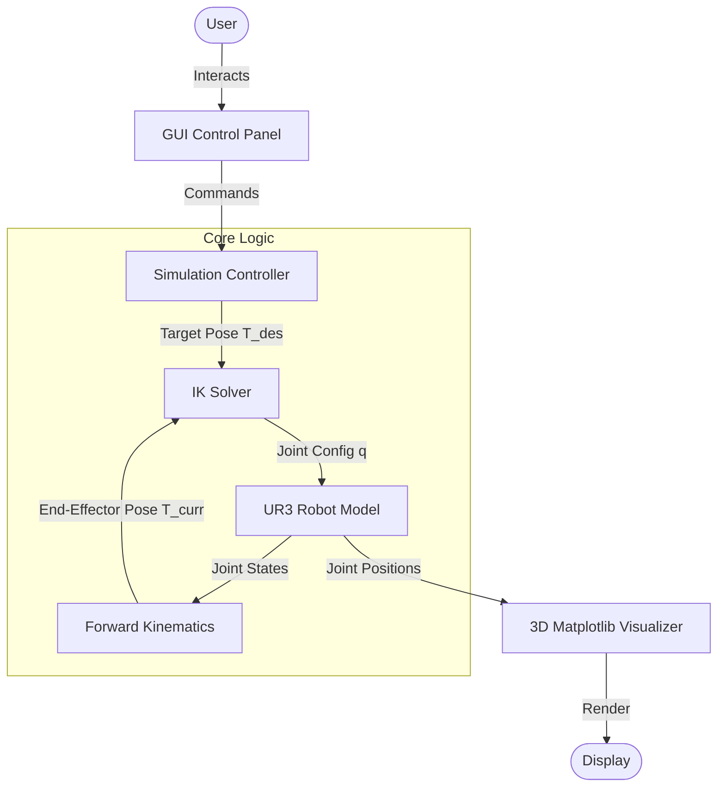
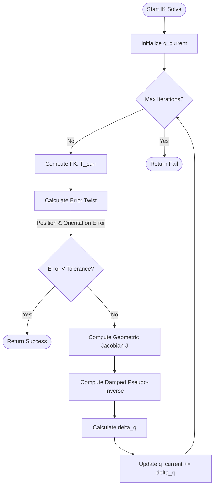

# Project Report: UR3 Inverse Kinematics Implementation

**Student Name:** Prathmesh Barapatre  
**Project:** Robot Mechanics and Control - Project 2  

## 1. Introduction
The objective of this project was to develop a complete kinematic simulation for a UR3 collaborative robot (co-bot). The simulation allows the robot to follow specified trajectories in 3D task space (SE(3)) while maintaining specific orientations. The core requirement was to implement the Inverse Kinematics (IK) solver from scratch using numerical methods, specifically the Newton-Raphson method, without relying on external robotics libraries.

## 2. Methodology

### 2.1 Forward Kinematics (FK)
The Forward Kinematics are calculated using the standard Denavit-Hartenberg (DH) parameters for the UR3 robot. The transformation from the base frame to the end-effector is achieved by multiplying the homogeneous transformation matrices of each link sequentially.

**DH Parameters Used:**
| Joint | $d$ (m) | $a$ (m) | $\alpha$ (rad) | $\theta$ offset |
|:-----:|:-------:|:-------:|:--------------:|:---------------:|
| 1     | 0.1519  | 0       | $\pi/2$        | 0               |
| 2     | 0       | -0.24365| 0              | 0               |
| 3     | 0       | -0.21325| 0              | 0               |
| 4     | 0.11235 | 0       | $\pi/2$        | 0               |
| 5     | 0.08535 | 0       | $-\pi/2$       | 0               |
| 6     | 0.0819  | 0       | 0              | 0               |

The transformation matrix $T_i$ for each link is computed as:
$$
T_i = \begin{bmatrix}
c\theta_i & -s\theta_ic\alpha_i & s\theta_is\alpha_i & a_ic\theta_i \\
s\theta_i & c\theta_ic\alpha_i & -c\theta_is\alpha_i & a_is\theta_i \\
0 & s\alpha_i & c\alpha_i & d_i \\
0 & 0 & 0 & 1
\end{bmatrix}
$$

### 2.2 Inverse Kinematics (IK)
The Inverse Kinematics problem is solved using the **Newton-Raphson** iterative method. This method finds the joint angles $q$ that minimize the error between the current end-effector pose and the target pose.

**Algorithm:**
1.  **Initialize** $q$ (start from current configuration).
2.  **Compute Error Twist** $\xi_{err}$:
    *   Position Error: $e_p = p_{target} - p_{current}$
    *   Orientation Error: Calculated using the vector cross-product method for the column vectors of the rotation matrices. $e_o = \frac{1}{2} \sum (R_{curr,i} \times R_{target,i})$
3.  **Compute Geometric Jacobian** $J(q)$:
    *   $J = [J_1 \dots J_6]$, where each column $J_i$ corresponds to joint $i$.
    *   For revolute joints: $J_v = z_{i-1} \times (p_{ee} - p_{i-1})$, $J_\omega = z_{i-1}$.
4.  **Solve for** $\Delta q$:
    *   Using **Damped Least Squares (DLS)** to ensure stability near singularities:
    *   $\Delta q = J^T (JJ^T + \lambda^2 I)^{-1} \xi_{err}$
5.  **Update** $q \leftarrow q + \Delta q$.
6.  Repeat until error is below tolerance or max iterations reached.

## 3. Implementation Details
The project is implemented in Python.
*   **`UR3Robot` Class**: Encapsulates the state ($q$), DH parameters, and methods for FK, Jacobian, and Newton-IK.
*   **Visualization**: Uses `matplotlib.pyplot` and `mpl_toolkits.mplot3d`.
    *   The robot is drawn as a stick figure by plotting lines between link frames.
    *   The end-effector frame is visualized using RGB quivers (Red=X, Green=Y, Blue=Z).
    *   A trace line (orange dashed) visualizes the path history.
*   **User Interface**: A sidebar on the right allows users to trigger trajectories or manually jog the robot.

## 4. Results
The simulation successfully demonstrates the UR3 robot following:
1.  **Square Trajectory**: Provides a test of linear path following with sharp corners.
2.  **Circle Trajectory**: Tests continuous non-linear path following.
3.  **Interactive Control**: Allows arbitrary movement, verifying the IK solver's general applicability.

The DLS implementation effectively prevents the solver from diverging when the robot is near limits or singularities.

## 5. Conclusion
A fully functional kinematic simulation was developed. The Newton-Raphson solver proved effective for this 6-DOF system, allowing for smooth trajectory tracking and interactive control. The geometric Jacobian derivation matches standard robotics theory, facilitating correct velocity mapping.

## 6. Diagrams

### 6.1 System Architecture
The following diagram illustrates the high-level architecture of the simulation software.

### 6.2 Inverse Kinematics Algorithm
The flowchart below details the numerical Newton-Raphson Inverse Kinematics algorithm implemented in the `UR3Robot` class.

